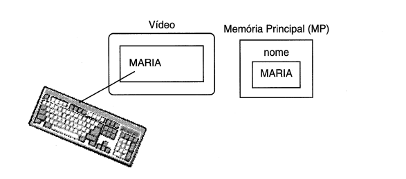
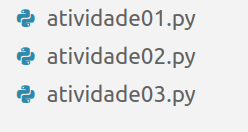

* Já vimos como fazer saída de dados em python:

```python
print("olá mundo")
```

* Vimos também com atribuir um valor para uma variável:

```python
idade = 29
print(idade)
```

* Vamos ver como faz entrada de dados em python:

* A entrada de dados é o comando que permite que o usuário digite uma informação e essa informação seja armazenada em uma variável.



```python
print("Digite seu nome")
nome = input()
print(nome)
```

* o Input sempre considera a entrada de dados como String.

* Lembrando que String são palavras que estão entre "".

ex.: 
```python

print("Digite um número")

n1 = input()

print("Digite outro número")

n2 = input()

print("A soma dos dois números é")

n3 = n1+n2

print(n3)

```

* O correto seria:

```python

print("Digite um número")

n1 = int(input())

print("Digite outro número")

n2 = int(input())

print("A soma dos dois números é")

n3 = n1+n2

print(n3)

```
>Fique atento aos verbos: Leia (input), imprima ou mostre(print)
# Atividades: 

## Observação




1. Imprimir a mensagem: "É PRECISO FAZER TODOS OS ALGORITMOS PARA
APRENDER".

2. Criar um algoritmo que imprima o produto entre 28 e 43.

3. Ler um número inteiro e imprimi-lo.

4. Ler dois números inteiros e imprimi-los.


5. Ler dois números inteiros e imprimir a soma


6. Ler dois números inteiros e imprimir o produto.


7. Ler quatros números inteiros e imprimir a média desses números.

