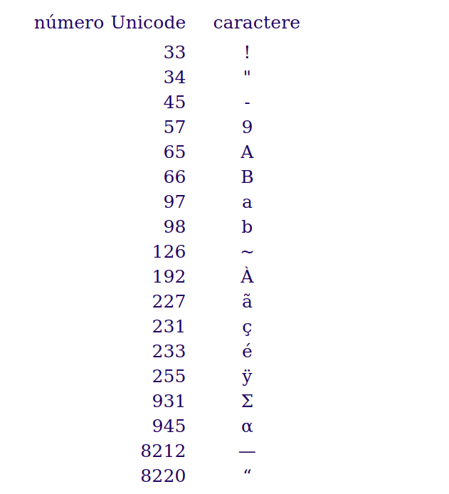
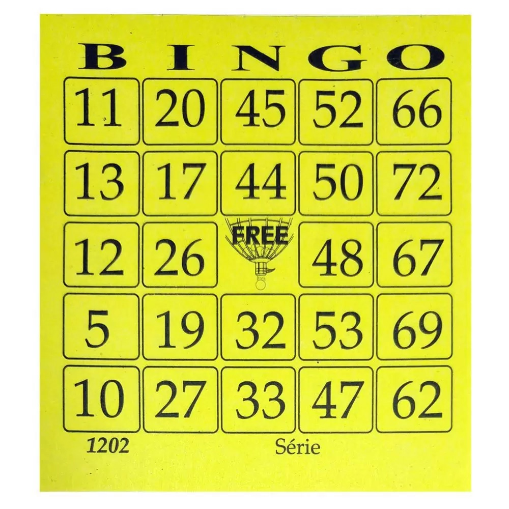
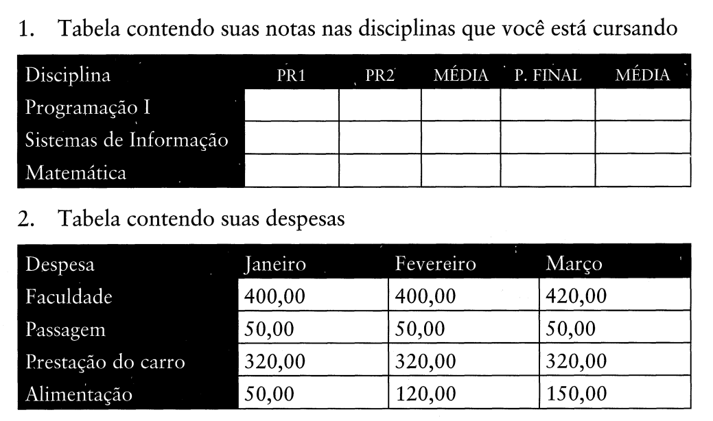
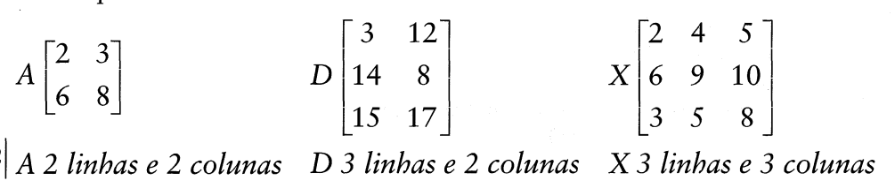
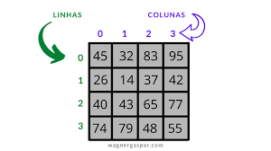

### Pegando a maior e a menor string:

* O python por padrão compara apenas a primeira letra:
* As letras que vem antes são consideradas menores.
* Letras maiúsculas são consideradas menores que as minúsculas


* Ele compara segundo a tabela UNICODE




* Unicode: O Unicode dá a cada caractere (letra, número, símbolo ou emoji) um número único. Esse número é uma forma padronizada para representar o caractere de forma consistente em qualquer sistema ou dispositivo.

* Depois esse número é convertido para binário

```python
letra = 'A'
codigo_unicode = ord(letra)

print(codigo_unicode)

```


``` python

frutas = ["abacate", "caju", "buriti"]
maior = max(frutas)
print(maior)

```

* Para comparar o tamanho da String, tenho que usar o ```len```

```python
 teste = ["abacate", "caju", "abacaxis"]
 maior = max(teste, key=len)
 print(maior)

```
* Caso tenha dois valores com o mesmo tamanho, ele retornará o primeiro

```pyhton
teste = ["abacates", "peras", "caju", "abacaxis", "maçã"]
maior = max(teste, key=len)
print(maior)
```

# CONCEITOS DE MATRIZES


[referência](https://papelariacriativa.com.br/produto/cartela-de-bingo-amarelo-com-100-folhas-9100/)




> Uma matriz, na verdade, é uma tabela contendo elemen-
t s que servirão de base para vários cálculos em muitas ciências tais como o
Estatística, Economia, Física, Ciência da Computação etc.

* Os elementos estão dispostos em linhas e colunas:




[Referência](https://wagnergaspar.com/estrutura-de-dado-matriz-array-bidimensional-em-portugol/)


## Em Python:
```python
matriz = [
    [1, 2, 3],
    [4, 5, 6],
    [7, 8, 9]
]


print(teste)

print(teste[0][1]) 
```
* Cada lista interna representa uma linha da matriz, e os elementos dentro da lista representam as colunas dessa linha.


## Exercícios 

1. Crie uma matriz 3x3 com números inteiros.   
    * Acesse o elemento na posição (1, 2) (segunda linha, terceira coluna).


1. Crie uma matriz 2x2 com números reias(float).   
    * Acesse o elemento na posição (1, 1) 