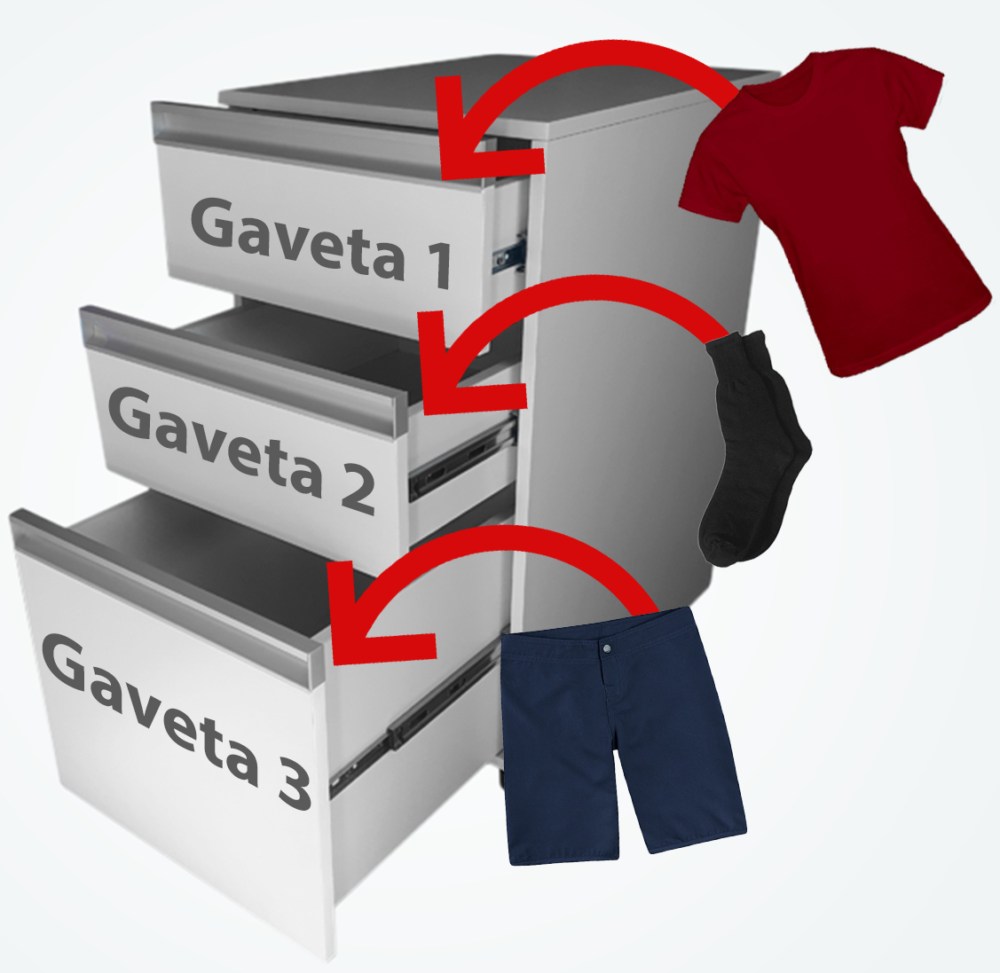

# O que são variáveis 

> Uma variável é um local na memória principal, isto é, um endereço que armazena um conteúdo. Em linguagens de alto nível, nos é permitido dar
nome a esse endereço para facilitar a programação.  
**Introdução à programação / Anita Lopes, Guto Garcia.**


ex.: 

fonte: https://www.devmedia.com.br/o-que-sao-variaveis/40728

* Vamos supor o seguinte código em python:

```python 
print("Pedro Vincios Sena de Matos")
print("Pedro Vincios Sena de Matos")
print("Pedro Vincios Sena de Matos")
print("Pedro Vincios Sena de Matos")
print("Pedro Vincios Sena de Matos")
print("Pedro Vincios Sena de Matos")
print("Pedro Vincios Sena de Matos")
print("Pedro Vincios Sena de Matos")
print("Pedro Vincios Sena de Matos")
print("Pedro Vincios Sena de Matos")
print("Pedro Vincios Sena de Matos")
print("Pedro Vincios Sena de Matos")
print("Pedro Vincios Sena de Matos")
print("Pedro Vincios Sena de Matos")
print("Pedro Vincios Sena de Matos")
print("Pedro Vincios Sena de Matos")
print("Pedro Vincios Sena de Matos")

```

* Se precisássemos Alterar o nome que é impresso na tela, precisariamos alterar todo o código. 
* E se fossem 1000 linhas?

```python 
nome = "Pedro Vinicios Sena de Matos"
print(nome)
print(nome)
print(nome)
print(nome)
print(nome)
print(nome)
print(nome)
print(nome)
print(nome)
print(nome)
print(nome)
print(nome)
print(nome)
print(nome)
print(nome)
print(nome)
print(nome)
```

* Quando criei a variável *nome*, solicitei ao computador que reservasse um espaço na memória para armazenar um valor. Depois de armazenar esse valor, só preciso utilizar o rótulo para chamá-lo.

* Como o próprio nome sugere, posso alterar o valor de uma variável. Por exemplo:

```python 
nome = "Pedro Vinicios Sena de Matos"
print(nome)
print(nome)
print(nome)


nome = "Luan"
print(nome)
print(nome)
print(nome)
print(nome)
print(nome)
print(nome)

nome = "Gilberto"
print(nome)
print(nome)
print(nome)
print(nome)
print(nome)

nome = "Neymar"
print(nome)
print(nome)
print(nome)
```

## Nomeando e usando variáveis 

* Nomes de váriaveis geralmente podem conter:
    * Letras, números e underscores.
    Ex.:

    ```python

        nome1 = "Pedro Vinicios Sena de Matos"
        print(nome1)
    ```

    * O próximo código irá retornar um erro:

     ```python

        nome% = "Pedro Vinicios Sena de Matos"
        print(nome1)
    ```
    **façam o teste**

    * As variáveis devem começar ou com uma letra ou com o underscore, nunca com um número. Ex.:
    ```python
        _nome = "pedro"

        print(_nome)
    ```

    * O próximo código irá retornar um erro:
    ```python
        1nome = "pedro"

        print(1nome)
        
     ```

    * Espaços em branco para nomear variáveis devem ser substituídos por underscores _. Ex.:

```python
        nome_completo = "pedro vinicios sena de matos"

        print(nome_completo)
        
 ```

  *  Evite usar palavras reservadas, que têm um propósito específico na linguagem de programação e não podem ser utilizadas como nomes para variáveis. Por exemplo:


```python
        print = "pedro vinicios sena de matos"

        print(print)
        
 ```
  * Para facilitar a descrição do que a variável armazena, é melhor nomeá-la de forma descritiva. Por exemplo, se eu quero criar uma variável que armazena um nome, é melhor chamá-la de **nome** do que apenas **n**.

  * Letras maiúsculas são diferentes de minúsculas.

    ```python 
        nome = "pedro vinicios sena de matos"
        NOME = "Luan"
        print(nome)
        print(NOME)
    ```

    **SEMPRE FIQUE ATENTO AOS ERROS NO TERMINAL**

    ## Tipos de dados:

    * Existem alguns tipos de dados que podemos manipular com variáveis. 

    * O tipo númerico é um tipo de dado que se divide basicamente em números inteiros e números reais. Exemplo em Python:

    ```python  
        # Tipo inteiro
        idade = 10

        print(idade)


        # Tipo real
        media = 9.5

        print(media)

    ```

    * Podemos fazer operações básicas com as variáveis, no exemplo abaixo, iremos somar 4 notas e calcular a média.

    ```python

        nota1 = 5.0
        nota2 = 6.0
        nota3 = 7.0
        nota4 = 8.0

        media = (nota1+nota2+nota3+nota4)/4


        print(media)

    ```


